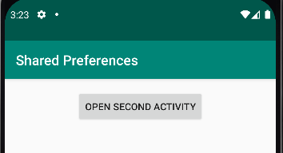
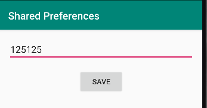
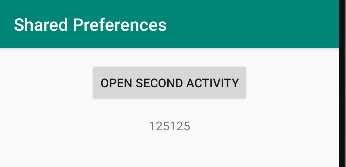

# Rapport
För att skicka min kod igenom views behövde jag använda mig av onResume vilket är ett väldigt användbart verktyg då jag inte behöver ladda om appen för att se sparad data.
Med onResume så tar jag emot data som jag skickar från SecondActivity genom att lagra det i shared preferences. 
Datan visas sedan upp i en textview som synes i figurerna nedan.

För att ta emot datan i mainactivity använder jag mig av följande kod, som helt enkelt läser shared preferencen med namnet key och sedan tilldelar jag den datan till textviewen dataTextView.
```java
  protected void onResume() {
        super.onResume();
        String savedData = sharedPreferences.getString("key", "default_value");
        dataTextView.setText(savedData);
    }
```
För att skicka själva datan är det ganska simpelt, jag skapar en sträng som konverterar all data jag skickar igenom till en sträng, dvs för att hantera siffror osv.
Sedan så skapar jag en sharedpreferences som heter pref och skapar en editor, och skickar sedan igenom datan vid knapptryck och stänger sedan aktiviteten.

```java
    saveButton.setOnClickListener(new View.OnClickListener() {
            @Override
            public void onClick(View v) {
                String dataToStore = dataEditText.getText().toString();

                SharedPreferences sharedPreferences = getSharedPreferences("pref", MODE_PRIVATE);
                SharedPreferences.Editor editor = sharedPreferences.edit();
                editor.putString("key", dataToStore);
                editor.apply();

                finish();
            }
        });
 ```




